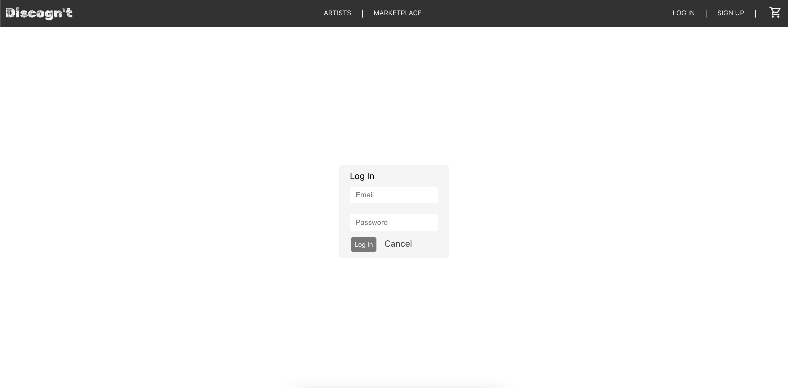
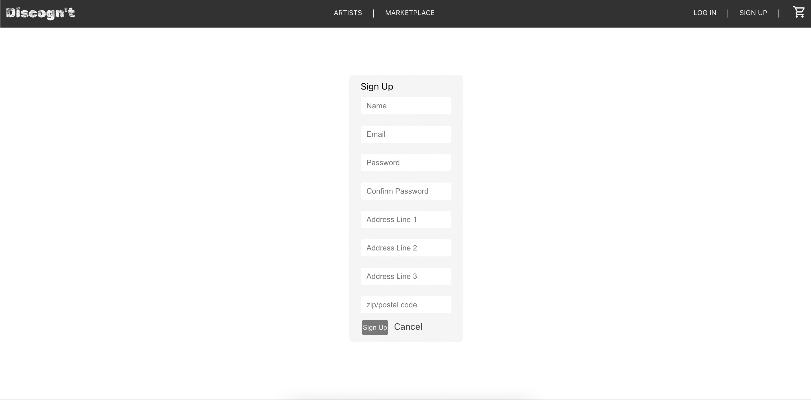
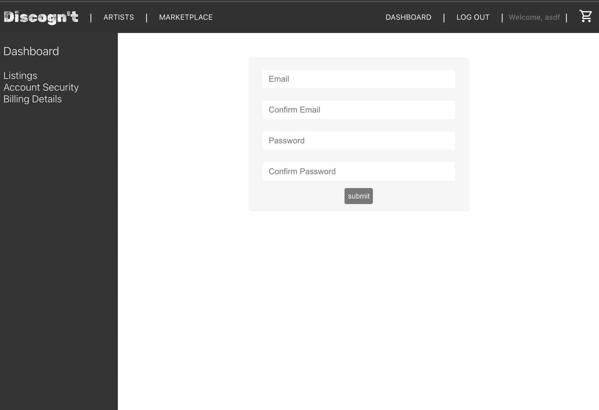
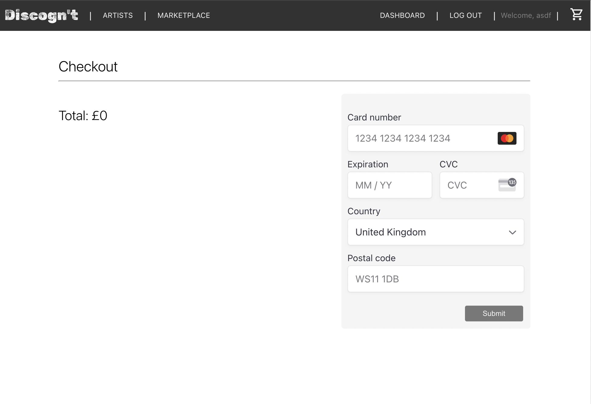
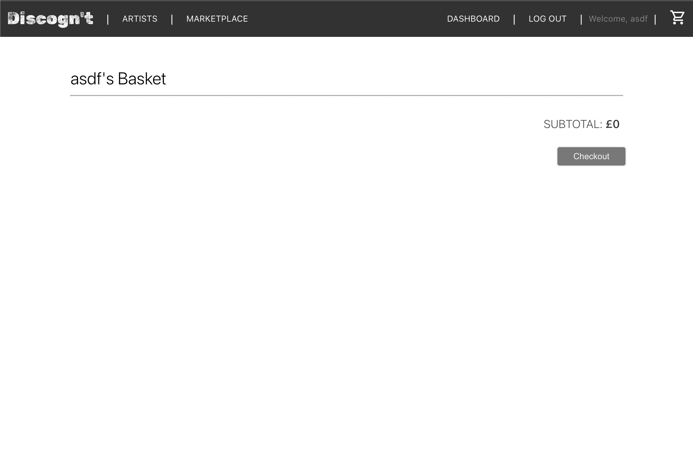

# Mod03-eCommerce

# Description

For this project, we created a full stack e-commerce site inspired by Discogs, a site that allows users to trade music records and put items up for sale.

# Getting Started

- Clone or download the repo.
- In the terminal check that you have Node.js installed: node --version
- Create a .env file in the server folder and make sure it’s added to your .gitignore.
- These are the required environment variables:  DATABASE_URL, SECRET, DISCOG_KEY, DISCOG_SECRET. To get the discog_key and discog_secret you’ll need to register here: https://www.discogs.com/settings/developers.
- In the client folder run npm install && npm run build
- In the server folder run npm install && npm start
- Start the client with npm start in the client folder.


# Timeframe and Working Team

The timeframe for this project was 2 weeks, and was completed in a group of 3.

# Technologies Used

JavaScript, HTML, CSS, Express, MongoDB, React.js, Discogs public API.

# Brief

- Build a full-stack application by making your own backend and your own front-end
- Use an Express API to serve your data from a Mongo database
- Consume your API with a separate front-end built with React
- Be a complete product which most likely means multiple relationships and CRUD functionality for at least a couple of models
- Implement thoughtful user stories/wireframes that are significant enough to help you know which features are core MVP and which you can cut
- Have a visually impressive design to kick your portfolio up a notch and have something to wow future clients & employers. ALLOW time for this.
- Be deployed online so it's publicly accessible.

# Planning


Planning consisted of three forks; the user facing front end, the database models and relations, and a set of user stories to help us conceptualise the needs of the user and determine which features were essential and which others could be considered for later expansion. In my case, I focused primarily on the planning of the front end, with the user control panel, basket, checkout and sign up/login pages being my contribution.

# Build Process

I initially built the signup, login and user dashboard pages with dummy variables so I could get the structure of the frontend done while waiting for work to be completed on the backend. Aside from viewing and changing user info, the dashboard’s primary purpose was to allow a user to create product listings for the items they wished to put up for sale.

Code governing the state of the login page and submitting credentials:
```
function LoginPage() {
 const navigate = useNavigate()
 const { handleSignupOrLogin } = useUser()
 
 const [formState, setFormState] = React.useState({
   email: '',
   password: ''
 });
 
 const handleChange = (e) => {
   setFormState({
     ...formState,
     // Using ES2015 Computed Property Names
     [e.target.name]: e.target.value
   });
 }
 const handleSubmit = async (e) => {
   e.preventDefault();
   try {
     await userService.login(formState);
     // Let <App> know a user has signed up!
     handleSignupOrLogin();
     // Successfully signed up - show GamePage
     navigate('/');
   } catch (err) {
     // Use a modal or toast in your apps instead of alert
     alert('Invalid Credentials!');
   }
 }
```
Login page:





Code governing the state of the sign up form:
```
function SignupForm({ updateMessage }) {
 const navigate = useNavigate();
 const { handleSignupOrLogin } = useUser();
 
 const [state, setState] = React.useState({
   name: "",
   email: "",
   password: "",
   passwordConf: "",
   address1: "",
   address2: "",
   address3: "",
   postcode: "",
 });
 
 const handleChange = (e) => {
   updateMessage("");
   setState((oldState) => ({
     ...oldState,
     // Using ES2015 Computed Property Names
     [e.target.name]: e.target.value,
   }));
 };
 
 const handleSubmit = async (e) => {
   e.preventDefault();
   try {
     await userService.signup(state);
     // Let <App> know a user has signed up!
     handleSignupOrLogin();
     // create collection and basket with user set as owner
     let ownerId = await userService.getUser()._id;
     await collection.create(ownerId);
     await cart.createCart(ownerId);
     // Successfully signed up - show GamePage
     navigate("/");
   } catch (err) {
     // Invalid user data (probably duplicate email)
     updateMessage(err.message);
   }
 };
 
 const isFormInvalid = () => {
   return !(
     state.name &&
     state.email &&
     state.password === state.passwordConf
   );
 };
```
Sign up page:



An issue that cropped up when I was setting up the user page was working out a means of securely storing sensitive data that would be used on an e-commerce site, billing details in particular. Were these stored on our own server, we would need to ensure they were properly encrypted, decrypted only when the correct client receives them, and so on. After discussing this with my tutor, I concluded it would be best practice to use an already verified third party payment processing system, rather than trying to build my own from scratch. In this instance I elected to use Stripe. After that I moved onto getting the functional components of the basket and checkout sorted, including calculation of the subtotal and passing that total along to the checkout page for later payment integration.

Frontend code for calculating and updating the basket subtotal:
```
const [basket, setBasket] = useState([])
   const [subtotal, setSubtotal] = useState(0);
   const { user } = useUser();
 
   // OBTAIN USER BASKET
   useEffect(() => {
       async function getCart() {
           const userCart = await listing.getListingsInCartbyLoggedInUser()
           console.log("userCart: ", userCart)
           setBasket([...userCart])
       }
       getCart()
   }, [user])
 
   // UPDATE BASKET TOTAL
   useEffect(() => {
       let prices = [];
       if (basket.length) {
           const handleSubtotal = (basket) => {
               basket.forEach((product) => {
                   prices.push(product.price)
               })
               return prices.reduce((a, b) => a + b)
           }
           setSubtotal(handleSubtotal(basket).toFixed(2))
       }
       console.log(subtotal);
   }, [basket, subtotal])
 
   // REMOVE FROM BASKET CART TROLLEY CARGO PLANE
   function handleClick(listingId) {
       async function deleteItem(listingId) {
           console.log(listingId)
           await listing.deleteListingFromCart(listingId)
           setBasket((prev) => [...prev.filter((listing) => (listing._id !== listingId))])
       }
       deleteItem(listingId);
   }
 ```

Integration of the Stripe payment element on the front end checkout page:
```
import { PaymentElement } from '@stripe/react-stripe-js';
 
const CheckoutForm = () => {
   const location = useLocation();
   const { subtotal } = location.state;
   console.log('the subtotal passed in is' + subtotal)
   return (
       <div className="checkout-wrapper">
           <h2>Checkout</h2>
           <hr></hr>
           <div className="stripe-wrapper">
               <h3>Total: £{subtotal}</h3>
               <form className="stripeForm">
 
                   <PaymentElement className="payment-element" />
                   <button id="stripeSubmit"><span>Submit</span></button>
               </form>
           </div>
       </div>
   );
};
```
Stripe backend integration:
```
export async function createPayment(req, res, next) {
   const { token, amount } = req.body;
   const idempotencyKey = uuidv4();
 
   const customer = await stripe.customers.create({ email: token.email, source: token })
   const result = await stripe.charges.create({
       amount: amount * 100,
       currency: "gbp",
       customer: customer.id,
       receipt_email: token.email
   }, { idempotencyKey })
   return res.json(result)
}
 
export async function shareClientSecret(req, res, next) {
   const intent = await stripe.paymentIntents.create({
       amount: 1099,
       currency: 'gbp',
       payment_method_types: ['card'],
   })
   console.log(intent)
   return res.send(intent)
}
```

There was one final group coding session wherein we tracked down and fixed the numerous bugs still present. After that was done and with all the functional components of the website working, I then did a final CSS pass on the user dashboard, basket and checkout.

User dashboard; Account security update form:




Checkout, with Stripe payment element:




User basket:



# Challenges

On a personal note, this project was in general quite challenging due to disrupted learning as a result of personal issues earlier in the month, which then flared up once more during the project time itself. This unfortunately meant that there were several concepts I was significantly less comfortable with during the project, which made the overall process more difficult than it would have been otherwise.

Another was the dynamic of working in a team; while we got along well, there were several times when we lost track of who was working on what, leading to one incident in particular where myself and another team member had been working on the basket; it was a stroke of luck that we’d approach the problem from opposite ends and could thus combine our half-complete solutions into a whole one when we realised.


# Wins

The first win was that my team was great to work with; we all got on well with one another and even shared similar tastes in music, which made the entire project much more enjoyable. 

I was also pleased with how the sections of the frontend I’d worked on looked, in particular the checkout and basket; getting them formatted and matching them with the style of the rest of the site had to be done on a tight time limit, thus I was pleased that they matched up well.

Finally, I learned how to pass properties around via React Router’s navlinks and how to provide arguments for onClick and submit functions in React.js , which in turn enabled me to automatically calculate the subtotal of a basket which could then be later passed into the Stripe element. 

# Key Learnings and Takeaways

One of the clearest takeaways for me during this project was the importance of clear communication with one’s team to ensure everyone’s spending their time on different aspects of the whole rather than accidentally working on the same part. On the positive side, despite it being a complex and difficult project to realise, being in a team consisting of level headed and easygoing colleagues made it much easier to focus on the technical issues. That showed me the importance of being able to gel with an existing team, beyond just technical competency.

# Bugs

- Stripe integration is limited; no actual payment process or basket price is fed into the Stripe payment element (to be rectified).
- 11th hour bug where album fetching became very slow (may well have been an issue with discogs API itself on the day).
- Basket does not list names/ratings of sellers.

# Future Improvements

- Fully implement Stripe integration.
- Fix basket to list names and ratings of sellers.
- I’ll likely also attempt a solo MERN project later to make sure I’m well rounded; the vast majority of the backend on this project was handled by another team member, thus I’d like to spend time focusing on that aspect to gain a better understanding of it.


